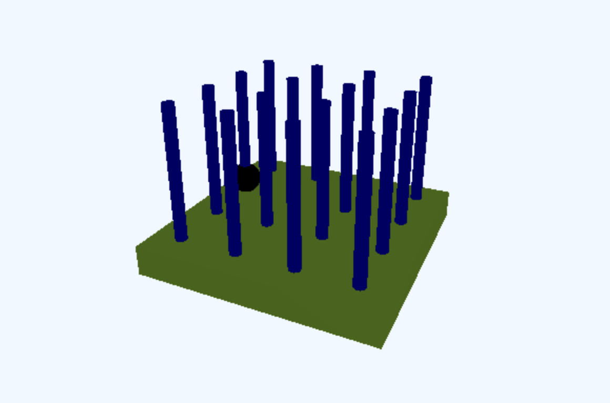
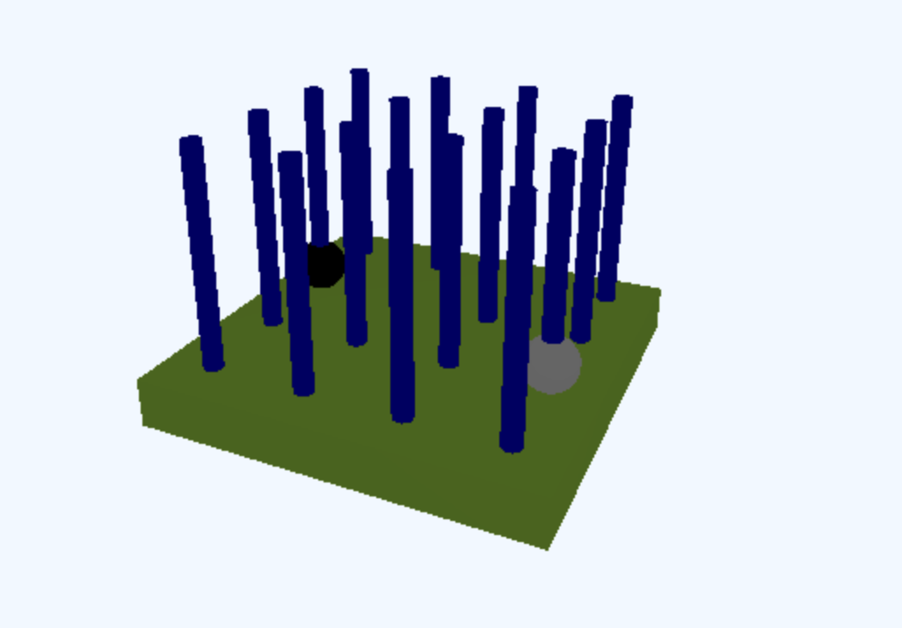
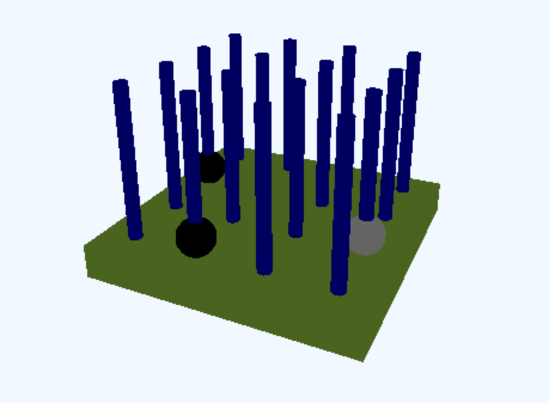
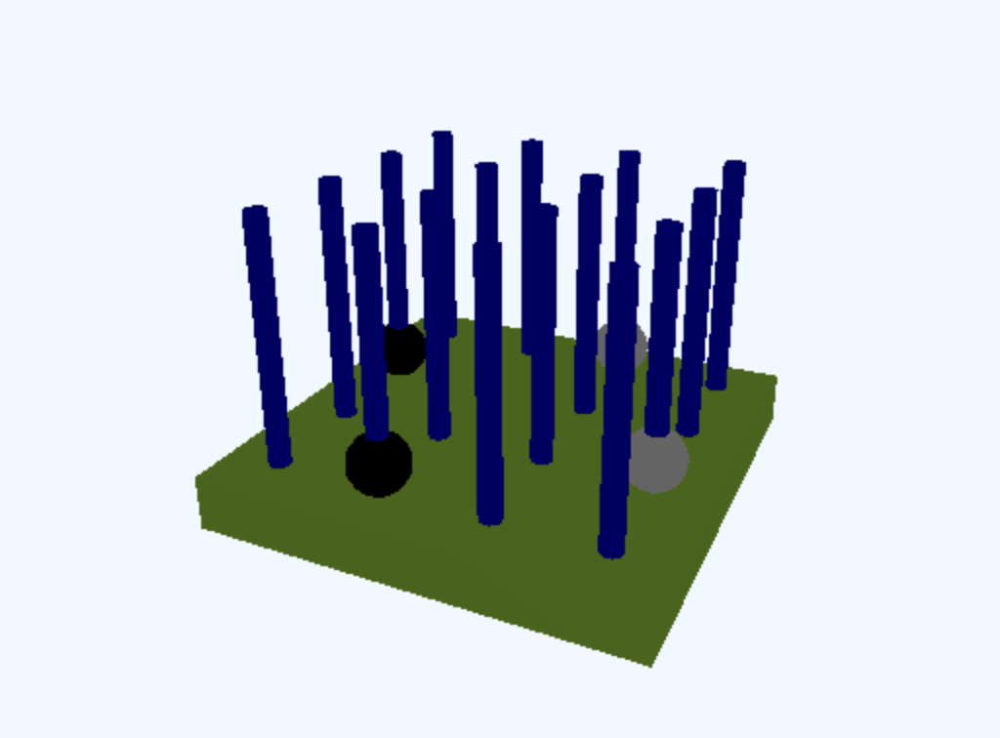

# board_rendererについて
## renderer
### 概要
立体4目並べの全手から盤面のアニメーションを作成する機能を担う。
### 使い方
`render(moves, interval=1000, browse=True): void`：全手から盤面のアニメーションを作成する関数。
- moves: 置いた場所の履歴を表す、整数の二次元リスト(表し方は下の例で見る)
- interval: アニメーションの切り替わり間隔(msec)
- browse: ブラウザで開くかどうか。Trueを指定した場合、ブラウザで盤面が表示される。Falseを指定した場合、ブラウザでの表示はせずに`board_renderer/result`ディレクトリ以下にファイルが追加される。
### 例
↓これを実行する
```
# テストデータ
moves = [
    [0, 1],
    [3, 2],
    [1, 3],
    [2, 0]
]

# 描画
render(moves)
```
1手目

2手目

3手目

4手目
